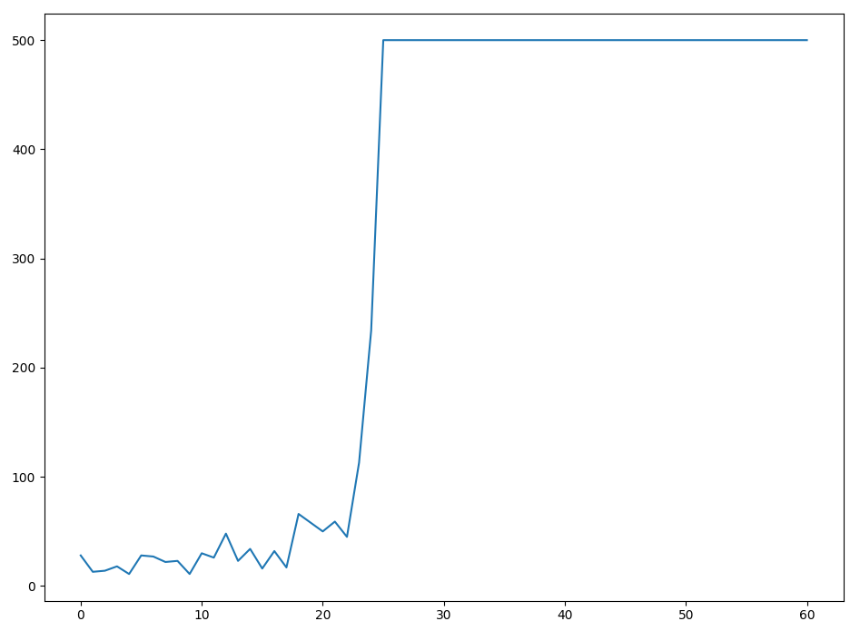

Cart Pole v0
------------

This folder contains few solutions for [Cart Pole v0 GYM environment](https://gym.openai.com/docs/).

How to run solution:
```commandline
python3 basic_dqn_keras.py
```

DQN with Keras shows **stable** results for many iterations:


Please note: 
- We increased the default limit of 200 steps up to 500 steps to get more interesting results
- The parameters of neural network can be different, we just "played" with different topologies 
and found out that there is no much difference between different number of neurons
(there should be "just enough" neurons) or activations functions (we tried sigmoid, tanh,
elu, gelu, relu) and we can't say that some of the modifications help to achiave better results
- During first 100 itrations we allow the agent to perform some random actions,
but after iteration #100 we do not allow random actions anymore
- Our memory size is infinite (we do not limit it there), and we teaching them model 
on full data set every iteration (epoch)

Recommendations
---------------
Two things are really important for the "good solution" of the task (if you work on your own):
- The probabilty of random actions (if there a high probability of random actions,
it is hard to achieve stable results, when the agent is able to get maximum score several iterations in a row)
- The reward function should be implemented in the right way, this is critical for the right solution of this task
  (with the right reward function model will learn faster and will not degradate ovr the time)
